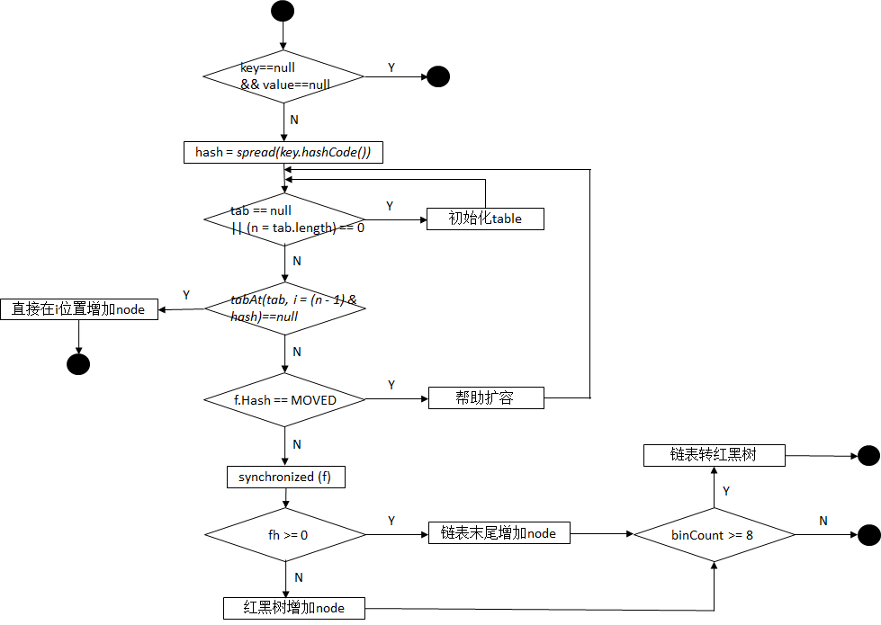

# ConcurrentHashMap源码解析 for JDK1.8

## 概述
> ConcurrentHashMap底层为数组+单链表/红黑树结构。   
> ConcurrentHashMap不允许null键或null值。   
> ConcurrentHashMap不保证键值对的顺序，键值的顺序可能会发生改变。   
> ConcurrentHashMap是线程安全的，通过CAS+synchronized保证并发安全。         

## 原理
> ConcurrentHashMap使用Node数组保存数据，Node本身是一个链表节点，它的val和next属性采用volatile关键字修饰保证线程可见性。   
> 当Node数组同一个位置上的节点数大于8个时将链表转为红黑树，当红黑树节点小于等于6个时转为链表结构储存，提高查找性能。    
> ConcurrentHashMap利用CAS操作+Synchronized同步锁来保证线程安全，在进行增删改操作时会对数组元素加锁(Node)。   

## 源码分析

### 重要常量
```Java
    /**
     * 最大容量2^30
     */
    private static final int MAXIMUM_CAPACITY = 1 << 30;

    /**
     * 默认容量2^4
     */
    private static final int DEFAULT_CAPACITY = 16;

    /**
     * toArray的最大长度
     */
    static final int MAX_ARRAY_SIZE = Integer.MAX_VALUE - 8;

    /**
     * 默认并发级别
     */
    private static final int DEFAULT_CONCURRENCY_LEVEL = 16;

    /**
     * 负载因子，默认为0.75f
     */
    private static final float LOAD_FACTOR = 0.75f;

    /**
     * 链表转红黑树的阀值
     */
    static final int TREEIFY_THRESHOLD = 8;

    /**
     * 红黑色转链表的阀值
     */
    static final int UNTREEIFY_THRESHOLD = 6;

    /**
     * 转换操作发生的最小容量
     */
    static final int MIN_TREEIFY_CAPACITY = 64;

    /**
     * 扩容线程所负责的区间大小最低为16，避免发生大量的内存冲突
     */
    private static final int MIN_TRANSFER_STRIDE = 16;

    /**
     * 用于生成当前数组对应的基数戳
     */
    private static int RESIZE_STAMP_BITS = 16;

    /**
     * 表示最多能有多少个线程能够帮助进行扩容，因为sizeCtl只有低16位用于标识，所以最多只有2^16-1个线程帮助扩容
     */
    private static final int MAX_RESIZERS = (1 << (32 - RESIZE_STAMP_BITS)) - 1;

    /**
     * 将基数戳左移的位数，保证左移后的基数戳为负值，然后再加上n+1,表示n个线程正在扩容
     */
    private static final int RESIZE_STAMP_SHIFT = 32 - RESIZE_STAMP_BITS;

    //hash值为-1处的节点代表forwarding node
    static final int MOVED     = -1; // hash for forwarding nodes
    //数组位置中红黑树根节点的hash值为-2，小于0
    static final int TREEBIN   = -2; // hash for roots of trees
    //保留字段
    static final int RESERVED  = -3; // hash for transient reservations
    //将HASH_BITS和普通节点的hash相与，将hash值最高位置0，从而保证普通节点的hash值都是>=0的
    static final int HASH_BITS = 0x7fffffff; // usable bits of normal node hash

    /** CPU核心数量 */
    static final int NCPU = Runtime.getRuntime().availableProcessors();
```

### 重要属性
```Java
    /**
     * 节点数组，用于存储键值对，当第一次插入时进行初始化。
     */
    transient volatile Node<K,V>[] table;

    /**
     * 只有当数组处于扩容过程时，nextTable才不为null;否则其他时刻，nextTable为null;
     * nextTable主要用于扩容过程中指向扩容后的新数组
     */
    private transient volatile Node<K,V>[] nextTable;

    /**
     * 基本计数器，用来保存ConcurrentHashMap中键值对的个数；
     * 在没有多线程竞争的情况下使用
     */
    private transient volatile long baseCount;

    /**
     * 当值为-1时, 代表数组正在被初始化;
     * 按照源码注释翻译，当值为-(1+扩容线程数), 代表数组正在被多个线程扩容。但是其实不是这样的，当线程进行扩容时，会根据resizeStamp函数生成一个基数戳rs，然后((rs<<RESIZE_STAMP_SHIFT)+n+1)这才是表示n个线程在扩容。
     * 当table为null时, 代表要初始化的容量大小; 否则代表下次要扩容的容量
     */
    private transient volatile int sizeCtl;

    /**
     * 用于扩容过程中，指示原数组下一个分割区间的上界位置
     */
    private transient volatile int transferIndex;

    /**
     * Spinlock (locked via CAS) used when resizing and/or creating CounterCells.
     */
    private transient volatile int cellsBusy;

    /**
     * 计数器表，多线程更新{@baseCount}时竞争失败的值
     */
    private transient volatile CounterCell[] counterCells;
```

### 构造函数
```Java
    /**
     * 使用默认大小(16)和默认负载因子(0.75f)创建一个空ConcurrentHashMap,第一次put操作时初始化.
     */
    public ConcurrentHashMap() {
    }

    /**
     * 使用指定初始容量和默认负载因子(0.75)初始化一个空ConcurrentHashMap,第一次put操作时初始化
     */
    public ConcurrentHashMap(int initialCapacity) {
    	// 初始化容量检查
        if (initialCapacity < 0)
            throw new IllegalArgumentException();
        int cap = ((initialCapacity >= (MAXIMUM_CAPACITY >>> 1)) ?
                   MAXIMUM_CAPACITY :
                   tableSizeFor(initialCapacity + (initialCapacity >>> 1) + 1));
        this.sizeCtl = cap;
    }

    /**
     * 构造一个包含指定map中所有节点的ConcurrentHashMap
     */
    public ConcurrentHashMap(Map<? extends K, ? extends V> m) {
        this.sizeCtl = DEFAULT_CAPACITY;
        putAll(m);
    }

    /**
     * 使用指定初始容量和负载因子构造一个空ConcurrentHashMap
     */
    public ConcurrentHashMap(int initialCapacity, float loadFactor) {
        this(initialCapacity, loadFactor, 1);
    }

    /**
     * 使用指定的初始容量、负载因子和并发数构造一个空ConcurrentHashMap
     */
    public ConcurrentHashMap(int initialCapacity,
                             float loadFactor, int concurrencyLevel) {
    	// 参数检查
        if (!(loadFactor > 0.0f) || initialCapacity < 0 || concurrencyLevel <= 0)
            throw new IllegalArgumentException();
        if (initialCapacity < concurrencyLevel)   // Use at least as many bins
            initialCapacity = concurrencyLevel;   // as estimated threads
        long size = (long)(1.0 + (long)initialCapacity / loadFactor);
        int cap = (size >= (long)MAXIMUM_CAPACITY) ?
            MAXIMUM_CAPACITY : tableSizeFor((int)size);
        this.sizeCtl = cap;
    }
```
### 插入操作


> 1. 参数检查，key或value为null抛异常NullPointerException();    
> 2. 如果table为空(未初始化),则初始化；   
> 3. 根据计算得到的table数组位置找到hash桶，如果桶为空，则创建Node节点作为桶的头结点(无锁操作)；    
> 4. 如果有其它线程正在扩容，则协助扩容；   
> 5. 如果hash桶中有节点，则使用synchronized锁住头结点，并再次校验头结点的hash值(期间有可能被其他线程更新)；   
> 6. 如果桶中存储的是链表结构，则遍历链表，找到相同key的节点(hashCode && equals)直接覆盖节点value，没有找到则创建Node节点插入链表尾部，插入后链表节点数如果大于8则将链表转为红黑树；   
> 7. 如果桶中存储的是树形结构，则调用红黑树节点方法追加节点；   
> 8. 增加baseCount计数，过程中有可能对table数组扩容；   

```Java
    public V put(K key, V value) {
        return putVal(key, value, false);
    }

    /**
     * 插入键值对
     * 
     * 流程：
     * 步骤1. 参数检查，key和value不允许为null
     * 步骤2. 如果table数组未初始化，则初始化
     * 步骤3. 计算并找到欲插入的键值对在table数组中的位置
     * 步骤4. 如果hash桶中没有节点，则直接创建Node节点(无锁操作)
     * 步骤5. 如果有其他线程正在扩容，则协助扩容
     * 步骤6. hash桶中有节点，synchronized锁住头节点，并再次校验头结点hash，以防其他线程更新
     * 步骤7. 如果桶中是链表结构，则遍历链表，有相同key的节点(hashCode & equals)直接覆盖value，没有相同节点创建新节点插入链表尾部，判断链表节点数大于8转为红黑树或扩容一倍容量
     * 步骤8. 如果桶中是红黑树结构，则调用红黑树的方法追加节点
     * 步骤9. 增加baseCount计数，过程中有可能需要扩容
     */
    final V putVal(K key, V value, boolean onlyIfAbsent) {
    	// 步骤1. 参数非空检查，key或value如果为null，则抛出异常，否则执行步骤2
        if (key == null || value == null) throw new NullPointerException();
        // 步骤2. 计算key的hash值，完成后执行步骤3
        int hash = spread(key.hashCode());
        int binCount = 0;
        for (Node<K,V>[] tab = table;;) { //外层死循环
            Node<K,V> f; int n, i, fh;
            // 步骤3. 如果table还没有初始化，则初始化table数组，完成后执行步骤5，否则执行步骤4
            if (tab == null || (n = tab.length) == 0)
                tab = initTable(); // 初始化table数组 
            // 步骤4. 如果桶为空，则尝试CAS操作直接插入新节点
            // 根据hash值计算得到数组下标并查看对应可桶，如果为空创建一个新节点CAS尝试插入
            else if ((f = tabAt(tab, i = (n - 1) & hash)) == null) {
                if (casTabAt(tab, i, null,
                             new Node<K,V>(hash, key, value, null)))
                    break;                   // no lock when adding to empty bin
            }
            // 步骤5. 如果当前桶中头节点的hash值为MOVED，说明有其他线程正在扩容，则帮助扩容
            else if ((fh = f.hash) == MOVED)
                tab = helpTransfer(tab, f);
            else {
                V oldVal = null;
                // 采用synchronized方式加锁，锁住头结点
                synchronized (f) {
                	// 步骤6. 二次校验头结点是否相同
                	// 重新取出桶中的头结点与之前取出的头结点作比较
                    if (tabAt(tab, i) == f) {
                    	// 步骤7. 桶中存储的是链表结构
                    	// 节点hash值大于等于0时为链表结构
                        if (fh >= 0) {
                            binCount = 1;
                            // 遍历链表的每个节点
                            for (Node<K,V> e = f;; ++binCount) {
                                K ek;
                                // 如果节点的key与要插入的key相等(hashCode equals),则覆盖节点value并跳出循环
                                if (e.hash == hash &&
                                    ((ek = e.key) == key ||
                                     (ek != null && key.equals(ek)))) {
                                    oldVal = e.val;
                                    if (!onlyIfAbsent)
                                        e.val = value;
                                    break;
                                }
                                // 如果找到链表尾部没有找到有相同key，则创建一个Node节点插入链表的尾部并跳出循环
                                Node<K,V> pred = e;
                                if ((e = e.next) == null) {
                                    pred.next = new Node<K,V>(hash, key,
                                                              value, null);
                                    break;
                                }
                            }
                        }
                        // 步骤8. 桶中存储的为红黑树结构
                        else if (f instanceof TreeBin) {
                            Node<K,V> p;
                            binCount = 2;
                            // 调用putTreeVal方法插入键值对
                            if ((p = ((TreeBin<K,V>)f).putTreeVal(hash, key,
                                                           value)) != null) {
                                oldVal = p.val;
                                if (!onlyIfAbsent)
                                    p.val = value;
                            }
                        }
                    }
                }
                //步骤9. 如果桶一桶中节点数达到8个时，扩容或将链表转为红黑树
                if (binCount != 0) {
                    if (binCount >= TREEIFY_THRESHOLD)
                        treeifyBin(tab, i);
                    if (oldVal != null)
                        return oldVal;
                    break;
                }
            }
        }
        addCount(1L, binCount); // 计数
        return null;
    }
```

### 查找操作
> 1. table数组为空或没有对应key的节点则返回null；   
> 2. 遍历table数组的每个bucket，如果桶中头结点是要查找的节点则返回头结点的值；   
> 3. 如果桶中头结点hash值为-1(MOVED)，表示当前正在扩容桶中存储的是ForwardingNode节点，则遍历nextTable数组查找节点；   
> 4. 如果桶中头结点hash值为-2(TREEBIN)，表示当前桶中为红黑树节点，则查找树节点；   
> 5. 如果桶中存储的是链表节点，则遍历链表查找对应节点；   


```Java
    /**
     * 返回指定key映射节点的值
     * 
     * 流程：
     * 步骤1. 如果数组为空或没有对应key的节点则返回null
     * 步骤2. 如果hash桶中头结点是要查找的节点则返回头结点的值
     * 步骤3. 如果hash值为-1(MOVED)，当前桶中为ForwardingNode节点，说明正在扩容，则遍历nextTable数组查找节点
     * 步骤3. 如果hash值为-2(TREEBIN)，当前桶中为红黑树节点，则查找树节点
     * 步骤4. 如果hash桶中存储的是链表则查找链表节点
     */
    public V get(Object key) {
        Node<K,V>[] tab; Node<K,V> e, p; int n, eh; K ek;
        // 计算hash值
        int h = spread(key.hashCode());
        // table数组不为空，且计算并找到的hash桶位中有节点时
        if ((tab = table) != null && (n = tab.length) > 0 &&
            (e = tabAt(tab, (n - 1) & h)) != null) {
        	// 头结点key与要查找的key相同(hashCode && equals)，则返回头结点
            if ((eh = e.hash) == h) {
                if ((ek = e.key) == key || (ek != null && key.equals(ek)))
                    return e.val;
            }
            // 如果是红黑树则查找红黑树节点
            else if (eh < 0)
                return (p = e.find(h, key)) != null ? p.val : null;
            // 如果是链表则查找链表节点
            while ((e = e.next) != null) {
                if (e.hash == h &&
                    ((ek = e.key) == key || (ek != null && key.equals(ek))))
                    return e.val;
            }
        }
        return null;
    }
```

### 扩容操作

> 1. 如果当前table数组长度大于允许扩容的最大值一半时，直接扩容至最大容量；   
> 2. 如果table数组为空，则CAS操作将sizeCtl设为-1，然后初始化table数组；   
> 3. 如果欲扩容值小于原扩容阀值或现有容量已经是允许的最大容量，则什么都不做结束扩容；    
> 4. 开始移动table数组中的节点，先判断如果没有其它线程在扩容，当前线程是最先扩容的线程，则创建一个两倍table大小的nextTable数组；   
> 5. 遍历table数组的每个bucket，如果桶为空，则放入ForwardingNode节点用来标识当前桶已被处理；   
> 6. 如果桶中是链表，则将链表做反序处理拆分为两个链表，分别放置到nextTable的i和i+n位置上，完成后在桶中放入ForwardingNode节点标识已经处理；   
> 7. 如果桶中是树，则将红黑树做反序处理拆分为两棵树并查看每棵树的节点数如果小于等于6时转换为链表，分别放置到nextTable的i和i+n位置上，完成后在桶中放入ForwardingNode节点标识已处理；   
> 8. table数组中的节点全部移动到nextTable后，将nextTable作为新的table数组，并更新sizeCtl为新容量的0.75倍，完成扩容；   


```Java
    /**
     * 扩容操作
     * 
     * 步骤1. 如果当前数组长度大于允许扩容的最大容量一半时，直接扩容至允许的最大容量
     * 步骤2. 如果table数组为空，则CAS操作将sizeCtl设置为-1，然后初始化table数组
     * 步骤3. 如果欲扩容值小于原扩容阀值或现有容量已经是允许的最大容量，则什么都不做结束扩容
     * 步骤4. 如果已经有其他线程正在扩容，则协助其它线程扩容，否则开启新扩容
     */
    private final void tryPresize(int size) {
    	// 给定的容量若>=MAXIMUM_CAPACITY的一半，直接扩容到允许的最大值，否则调用函数扩容 
        int c = (size >= (MAXIMUM_CAPACITY >>> 1)) ? MAXIMUM_CAPACITY :
            tableSizeFor(size + (size >>> 1) + 1);
        int sc;
        while ((sc = sizeCtl) >= 0) {
            Node<K,V>[] tab = table; int n;
            // 如果table数组为空，则初始化table
            if (tab == null || (n = tab.length) == 0) {
                n = (sc > c) ? sc : c; // 扩容阀值取较大者 
                // CAS尝试将sizeCtl设置为-1，表示正在进行初始化
                if (U.compareAndSwapInt(this, SIZECTL, sc, -1)) {
                    try {
                        if (table == tab) {
                            @SuppressWarnings("unchecked")
                            Node<K,V>[] nt = (Node<K,V>[])new Node<?,?>[n];
                            table = nt;
                            sc = n - (n >>> 2);// 计算扩容阀值
                        }
                    } finally {
                        sizeCtl = sc; // 更新扩容阀值
                    }
                }
            }
            // 如果欲扩容值不大于原阀值，或现有容量达到最大值则跳出循环什么都不做
            else if (c <= sc || n >= MAXIMUM_CAPACITY)
                break;
            // table数组不为空且期间没有其他线程修改table
            else if (tab == table) {
                int rs = resizeStamp(n);
                // 如果有其他线程正在扩容，则帮助扩容
                if (sc < 0) {
                    Node<K,V>[] nt;
                    if ((sc >>> RESIZE_STAMP_SHIFT) != rs || sc == rs + 1 ||
                        sc == rs + MAX_RESIZERS || (nt = nextTable) == null ||
                        transferIndex <= 0)
                        break;
                    //辅助扩容操作，将sizeCtl加1，表示新增加一个线程辅助扩容
                    if (U.compareAndSwapInt(this, SIZECTL, sc, sc + 1))
                        transfer(tab, nt);
                }
                // 没有正在扩容table数组的线程，开始新的扩容
                else if (U.compareAndSwapInt(this, SIZECTL, sc,
                                             (rs << RESIZE_STAMP_SHIFT) + 2))
                    transfer(tab, null);
            }
        }
    }

    /**
     * 辅助扩容操作，将table数组中的每个节点移动到新数组中
     * 
     * 整个扩容分为两部分
     * 第一部分：构建一个原数组两倍大小的目标数组nextTable，这个操作是单线程完成的。
     * 第二部分：将原table数组中的元素复制到目标数组nextTable中，此步允许多线程操作。
     * 
     * 复制过程中的单线程操作流程：
     * 步骤1. 如果hash桶为空，则在桶中放入ForwardingNode节点，标识当前节点已被处理。
     * 步骤2. 如果hash桶是一个链表的头结点，则做反序处理，把他们分别放在目标数组的i和i+n位置上，在当前hash桶放在ForwardingNode节点。
     * 步骤3. 如果hash桶是一个红黑树节点，则做反序处理，并且判断是否需要转为链表，把处理的结果放在目标数组的i和i+n位置上，在当前hash桶放在ForwardingNode节点。
     * 步骤4. 复制工作完成后，将目标数组作为新的table数组，并且更新sizeCtl为新容量的0.75倍，完成扩容。
     * 
     * 多线程扩容的线程安全问题：
     * 每个线程处理完一个节点后，就把对应的节点设置为ForwardingNode节点。
     * 当其其它线程遍历到节点为ForwardingNode节点时，就跳过向后继续遍历，再加上头结点加锁机制，就很好的解决了线程安全问题。
     */
    private final void transfer(Node<K,V>[] tab, Node<K,V>[] nextTab) {
        int n = tab.length, stride;
        // 细分每个CPU处理最少16个数组长度的数组元素
        if ((stride = (NCPU > 1) ? (n >>> 3) / NCPU : n) < MIN_TRANSFER_STRIDE)
            stride = MIN_TRANSFER_STRIDE; // subdivide range
        // 如果目标数组为null，则初始化一个table数组两倍长度的nextTab数组
        // 只有第一个开始扩容的线程需要初始化目标数组
        if (nextTab == null) {            // initiating
            try {
                @SuppressWarnings("unchecked")
                Node<K,V>[] nt = (Node<K,V>[])new Node<?,?>[n << 1];
                nextTab = nt;
            } catch (Throwable ex) {      // try to cope with OOME
                sizeCtl = Integer.MAX_VALUE;
                return;
            }
            nextTable = nextTab;
            transferIndex = n;
        }
        int nextn = nextTab.length;
        // 创建一个ForwardingNode节点用来控制并发，当一个节点为空或已经被转移之后，就设置为ForwardingNode节点
        // 表示空节点标识，其他线程遇到此节点直接跳过不处理
        ForwardingNode<K,V> fwd = new ForwardingNode<K,V>(nextTab);
        boolean advance = true; // 是否继续向前查找的标识
        boolean finishing = false; // 保证在提交扩容后的新数组时，原数组中的所有元素都已经被遍历
        for (int i = 0, bound = 0;;) {
            Node<K,V> f; int fh;
            while (advance) {
                int nextIndex, nextBound;
                //bound为数组区间下限值，i为当前转移数组的位置,--i处理转移下一个节点位置，从后往前处理
                if (--i >= bound || finishing)
                    advance = false;// 跳出while循环
                //表示原数组已经分割完了
                else if ((nextIndex = transferIndex) <= 0) {
                    i = -1;
                    advance = false;// 跳出while循环
                }
                //CAS操作修改transferIndex值，代表下一个线程转移原数组的节点的位置
                else if (U.compareAndSwapInt
                         (this, TRANSFERINDEX, nextIndex,
                          nextBound = (nextIndex > stride ?
                                       nextIndex - stride : 0))) {
                    bound = nextBound; //设置当前线程转移原数组区间的下限值
                    i = nextIndex - 1; //从后往前处理
                    advance = false; //退出while循环
                }
            }
            if (i < 0 || i >= n || i + n >= nextn) {
                int sc;
                // 如果扩容完成
                if (finishing) {
                    nextTable = null; // 将nextTable设置为null,标识当前扩容过程完成
                    table = nextTab; // table指向扩容后的新数组
                    sizeCtl = (n << 1) - (n >>> 1); // 将sizeCtl设置为正数，设置为原数组的3/2，即新数组的3/4
                    return;
                }
                // 如果最后一个线程完成扩容操作时，将finishing置为true，表示正确完成。
                if (U.compareAndSwapInt(this, SIZECTL, sc = sizeCtl, sc - 1)) {
                    if ((sc - 2) != resizeStamp(n) << RESIZE_STAMP_SHIFT)
                        return;
                    finishing = advance = true;
                    i = n; // recheck before commit
                }
            }
            // 如果当前桶为null，将ForwardingNode节点放入桶中，标识此节点已被处理
            else if ((f = tabAt(tab, i)) == null)
                advance = casTabAt(tab, i, null, fwd);
            // 如果当前桶已经被处理，直接跳过
            else if ((fh = f.hash) == MOVED)
                advance = true; // already processed
            // 如果当前hash桶需要处理，则将元素转移至新数组上
            else {
            	// 锁住头结点
                synchronized (f) {
                    if (tabAt(tab, i) == f) {// 再次校验，防止hash被其他线程修改
                        Node<K,V> ln, hn;
                        if (fh >= 0) { //如果是Node节点，说明是链表结构 
                        	// hash值与原数组容量取模，结果为0则移动到新数组的原位置，否则移动到新数组的 原位置+数组长度 位置
                            int runBit = fh & n;
                            Node<K,V> lastRun = f;
                            /*
                             * lastRun 表示的是需要复制的最后一个节点
                             * 每当新节点的hash&n -> b 发生变化的时候，就把runBit设置为这个结果b
                             * 这样for循环之后，runBit的值就是最后不变的hash&n的值
                             * 而lastRun的值就是最后一次导致hash&n 发生变化的节点(假设为p节点)
                             * 为什么要这么做呢？因为p节点后面的节点的hash&n 值跟p节点是一样的，
                             * 所以在复制到新的table的时候，它肯定还是跟p节点在同一个位置
                             * 在复制完p节点之后，p节点的next节点还是指向它原来的节点，就不需要进行复制了，自己就被带过去了
                             * 这也就导致了一个问题就是复制后的链表的顺序并不一定是原来的倒序
                             */
                            for (Node<K,V> p = f.next; p != null; p = p.next) {
                                int b = p.hash & n;
                                if (b != runBit) {
                                    runBit = b;
                                    lastRun = p;
                                }
                            }
                            if (runBit == 0) {
                                ln = lastRun;
                                hn = null;
                            }
                            else {
                                hn = lastRun;
                                ln = null;
                            }
                            /*
                             * 构造两个链表，顺序大部分和原来是反的
                             * 分别放到原来的位置和新增加的长度的相同位置(i/n+i)
                             */
                            for (Node<K,V> p = f; p != lastRun; p = p.next) {
                                int ph = p.hash; K pk = p.key; V pv = p.val;
                                if ((ph & n) == 0)
                                	/*
                                     * 假设runBit的值为0，
                                     * 则第一次进入这个设置的时候相当于把旧的序列的最后一次发生hash变化的节点(该节点后面可能还有hash计算后同为0的节点)设置到旧的table的第一个hash计算后为0的节点下一个节点
                                     * 并且把自己返回，然后在下次进来的时候把它自己设置为后面节点的下一个节点
                                     */

                                    ln = new Node<K,V>(ph, pk, pv, ln);
                                else
                                	/*
                                     * 假设runBit的值不为0，
                                     * 则第一次进入这个设置的时候相当于把旧的序列的最后一次发生hash变化的节点(该节点后面可能还有hash计算后同不为0的节点)设置到旧的table的第一个hash计算后不为0的节点下一个节点
                                     * 并且把自己返回，然后在下次进来的时候把它自己设置为后面节点的下一个节点
                                     */
                                    hn = new Node<K,V>(ph, pk, pv, hn);
                            }
                            setTabAt(nextTab, i, ln);
                            setTabAt(nextTab, i + n, hn);
                            setTabAt(tab, i, fwd);
                            advance = true;
                        }
                        // 如果hash桶中存储的是树
                        else if (f instanceof TreeBin) {
                            TreeBin<K,V> t = (TreeBin<K,V>)f;
                            TreeNode<K,V> lo = null, loTail = null;
                            TreeNode<K,V> hi = null, hiTail = null;
                            int lc = 0, hc = 0;
                            for (Node<K,V> e = t.first; e != null; e = e.next) {
                                int h = e.hash;
                                TreeNode<K,V> p = new TreeNode<K,V>
                                    (h, e.key, e.val, null, null);
                                if ((h & n) == 0) {
                                    if ((p.prev = loTail) == null)
                                        lo = p;
                                    else
                                        loTail.next = p;
                                    loTail = p;
                                    ++lc;
                                }
                                else {
                                    if ((p.prev = hiTail) == null)
                                        hi = p;
                                    else
                                        hiTail.next = p;
                                    hiTail = p;
                                    ++hc;
                                }
                            }
                            // 如果树中元素小于等于6转为链表
                            ln = (lc <= UNTREEIFY_THRESHOLD) ? untreeify(lo) :
                                (hc != 0) ? new TreeBin<K,V>(lo) : t;
                            hn = (hc <= UNTREEIFY_THRESHOLD) ? untreeify(hi) :
                                (lc != 0) ? new TreeBin<K,V>(hi) : t;
                            setTabAt(nextTab, i, ln);
                            setTabAt(nextTab, i + n, hn);
                            setTabAt(tab, i, fwd);
                            advance = true;
                        }
                    }
                }
            }
        }
    }
```

## JDK1.8与JDK1.7的区别

* 数据结构   
	> JDK1.7中采用Segment数组 + HashEntry数组的方式实现，Segment数组的意义就是将一个大的table分割成多个小的table来进行加锁，也就是锁分离技术，而每一个Segment元素存储的是HashEntry数组 + 链表。分段是一开始就确定的，后期不能再进行扩容（即并发度不能改变），但是单个Segment里面的数组是可以扩容的。      
	
* put操作   
	> JDK1.7中当执行put操作时，会进行第一次key的hash来定位Segment的位置，如果该Segment还没有初始化，即通过CAS操作进行赋值，然后进行第二次hash操作，找到相应的HashEntry的位置，这里会利用继承过来的锁的特性，在将数据插入指定的HashEntry位置时（链表的尾端），会通过继承ReentrantLock的tryLock（）方法尝试去获取锁，如果获取成功就直接插入相应的位置，如果已经有线程获取该Segment的锁，那当前线程会以自旋的方式去继续的调用tryLock（）方法去获取锁，超过指定次数就挂起，等待唤醒。   
	
* get操作   
	> JDK1.7中get操作需要经过一次hash定位到Segment的位置，然后再hash定位到指定的HashEntry，遍历该HashEntry下的链表进行对比，成功就返回，不成功就返回null。   
	
* 计算size   
	> JDK1.7中计算size时，为解决并发操作时可能会导致计算出来的size和实际的size有相差的问题，先无锁操作尝试多次计算size，最多三次，比较前后两次的计算结果，如果一致则返回此值，如果不一致则给每个Segment加锁，再次计算size。    
	


